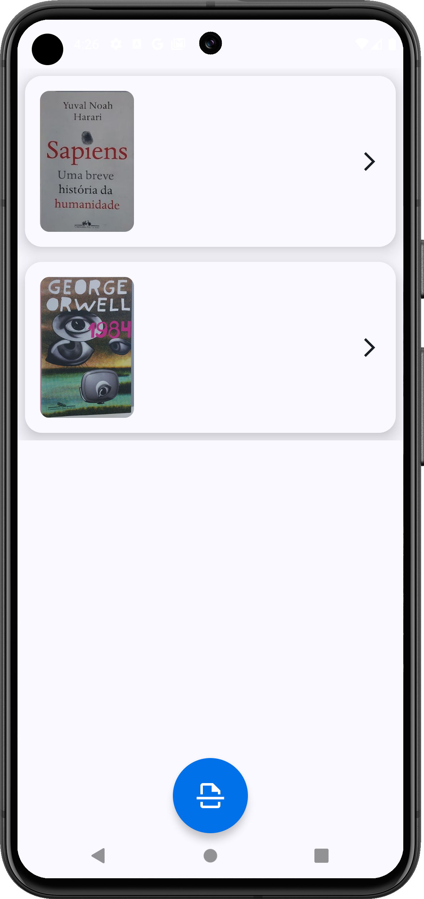

# Document Scanner📄

  

## Table of Contents
- [Introduction](#introduction)
- [Preview](#preview)
- [Technologies Used](#technologies-used)
- [Installation](#installation)
- [Contributing](#contributing)
- [License](#license)

## Introduction
Document Scanner is an Android application for scanning, processing, and storing documents using your mobile device's camera with Google's machine Learning technologies.

## Preview

  
  
  
  

## Technologies Used
- [Kotlin](https://kotlinlang.org)
- [Jetpack Compose](developer.android.com/develop/ui/compose)
- [Koin (Dependency Injection)](https://insert-koin.io)
- [Atlas Device SDK (Store Data)](https://www.mongodb.com/docs/atlas/device-sdks/sdk/kotlin/)
- [Coroutines](https://kotlinlang.org/docs/coroutines-overview.html)
- [Google Machine Learning Kit](https://developers.google.com/ml-kit/vision/doc-scanner/android)

## Installation
1. Clone this repository
2. Open this project in Android Studio
3. Build and run the application on your Android device or emulator

Or:

- Download the APK from my [Portfolio](https://guilhermeignacio.vercel.app) clicking [here](guilhermeignacio.vercel.app/projects/documentScanner/app-release.apk)

## Contributing
Contributions are what make the open-source community such an amazing place to learn, inspire, and create. Any contributions you make are **greatly appreciated**.

1. **Fork the Project**
2. **Create your Feature Branch** (`git checkout -b feature/AmazingFeature`)
3. **Commit your Changes** (`git commit -m 'Add some AmazingFeature'`)
4. **Push to the Branch** (`git push origin feature/AmazingFeature`)
5. **Open a Pull Request**

## License
Distributed under the MIT License.

---